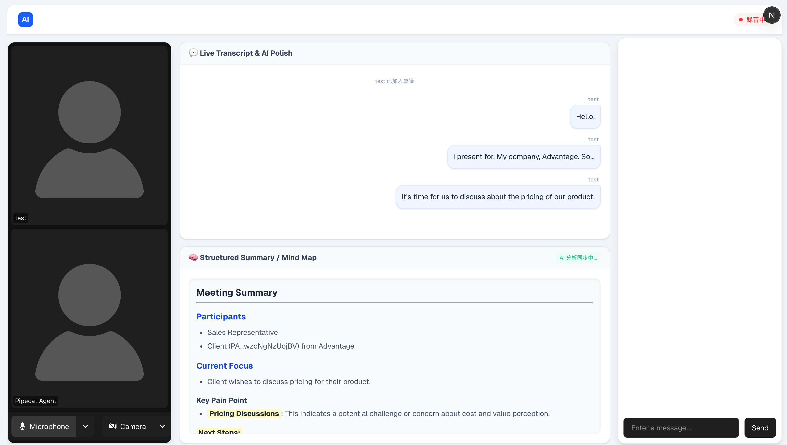

# Welcome
This project implements a real-time, multi-user conversational AI voice agent. The system is divided into a modern web frontend and a Python-based AI backend, communicating seamlessly via WebRTC.

## System: Frontend (Client & Token API)
- Tech Stack: `Next.js`, `React`, `TypeScript`.
- RTC Interface: Utilizes `@livekit/components-react` to build a responsive, real-time meeting room UI.
- Authentication: A `Next.js API route` uses the `livekit-server-sdk` to securely generate dynamic room access tokens based on user inputs.
- Real-time UI: Listens to `WebRTC Data Channels` to instantly render AI-generated transcripts.
- Notes: Summarize with `react-markdown` in mind map.

## System: Backend (AI Voice Agent)
- Tech Stack: `Python`, `Pipecat AI Framework`.
- AI Pipeline: Orchestrates `Voice Activity Detection (VAD)`, `Speech-to-Text (STT)`, `LLM processing`, and `Text-to-Speech (TTS)` into a continuous, low-latency stream.

## Present

## Deploy

### Backend (Render Web Service)
- **Root Directory**: `backend`
- **Build Command**: `pip install -r requirements.txt`
- **Start Command**: `python server.py`
- **Environment Variables**:
  | Variable | Description |
  |---|---|
  | `LIVEKIT_URL` | LiveKit server WebSocket URL (e.g. `wss://….livekit.cloud`) |
  | `LIVEKIT_API_KEY` | LiveKit API key |
  | `LIVEKIT_API_SECRET` | LiveKit API secret |
  | `OPENAI_API_KEY` | OpenAI API key |
  | `BACKEND_URL` | Public URL of this service (e.g. `https://pipecat-backend.onrender.com`) – used for keep-alive pings |
  | `FRONTEND_URL` | Frontend origin URL (e.g. `https://pipecat-frontend.vercel.app`) – restricts CORS to this origin; leave unset to allow all origins |
  | `PORT` | Port to listen on (Render sets this automatically, default `10000`) |

### Frontend (Vercel / Render Static Site)
- **Environment Variables**:
  | Variable | Description |
  |---|---|
  | `LIVEKIT_API_KEY` | LiveKit API key (for token generation in Next.js API route) |
  | `LIVEKIT_API_SECRET` | LiveKit API secret |
  | `NEXT_PUBLIC_LIVEKIT_URL` | LiveKit server URL (exposed to browser) |
  | `NEXT_PUBLIC_BACKEND_URL` | Backend service URL (e.g. `https://pipecat-backend.onrender.com`) – used to trigger the agent |

## Reference
1. [LiveKit](https://livekit.com)
2. Pipecat
    - [Github Repo](https://github.com/pipecat-ai/pipecat/tree/main)
    - [Docs](https://docs.pipecat.ai/server/services/stt/openai)

## Code Examples
1. [transports-livekit](https://github.com/pipecat-ai/pipecat/blob/main/examples/transports/transports-livekit.py)

